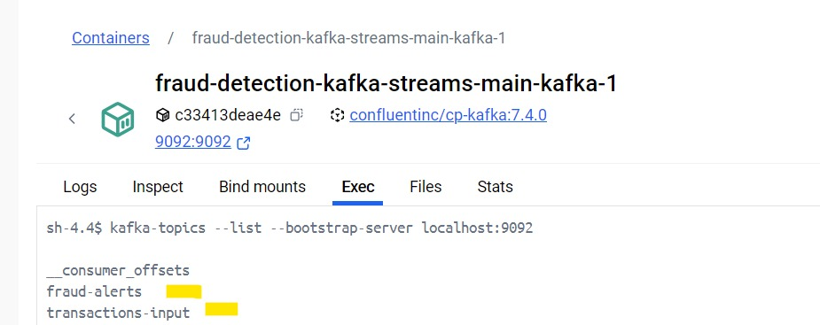
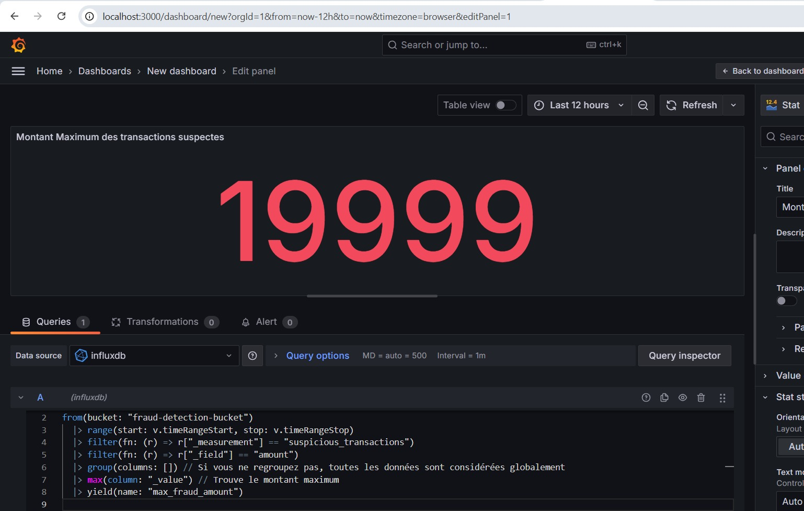

### Salma EZACCANI
# Détection de Fraudes avec Kafka Streams Grafana et InfluxDB

## Description du Projet

Ce projet implémente une solution complète pour détecter les transactions financières suspectes en temps réel, stocker les résultats dans une base de données InfluxDB, et visualiser les données à l'aide de Grafana.

## Fonctionnalités
- **Kafka Streams** : Traitement en temps réel des flux de transactions.
- **Détection de fraudes** : Détection des transactions avec montant supérieur à un seuil défini (par défaut : 10 000).
- **InfluxDB** : Stockage des transactions suspectes.
- **Grafana** : Visualisation en temps réel avec des graphiques interactifs.
- **Docker Compose** : Environnement de déploiement complet pour Kafka, InfluxDB, et Grafana.


## Architecture

L'architecture inclut :
- Un producteur Kafka générant des transactions JSON.
- Kafka Streams pour le traitement en temps réel.
- InfluxDB pour le stockage des données suspectes.
- Grafana pour la visualisation.

## Configuration et Déploiement

1. Lancez les services avec Docker Compose :
   ```bash
   docker-compose up -d
   ```


2. Configurez Grafana pour se connecter à InfluxDB :
   - Ajoutez une nouvelle source de données avec les paramètres suivants :
      - URL : `http://influxdb:8086`
      - Bucket : `fraud-detection-bucket`
      - Organisation : `fraud-detection-org`

3. Configurez les topics Kafka :
```bash
kafka-topics --create --topic transactions-input --bootstrap-server localhost:9092
kafka-topics --create --topic fraud-alerts --bootstrap-server localhost:9092
   ```


4. Configurez Consumer et Producer 
   ```bash
   kafka-console-consumer --topic fraud-alerts --bootstrap-server localhost:9092
   kafka-console-producer --topic transactions-input --bootstrap-server localhost:9092
   ```
 

## Exemple de Transaction JSON

Voici un exemple de transaction financière consommée depuis `transactions-input` :
```json
{
  "userId": "12345",
  "amount": 15000,
  "timestamp": "2024-12-04T15:00:00Z"
}
```

## Règles de Détection

Les transactions sont considérées comme suspectes si :
- Le montant (`amount`) est supérieur à 10 000.

Les transactions suspectes sont publiées dans le topic `fraud-alerts` et sauvegardées dans InfluxDB.

## Test et Validation

1. Dans Jupyter Utilisez le script Python fourni (`transaction.py`) pour générer des transactions test 
   


2. Vérifiez que les transactions suspectes sont présentes dans le topic `fraud-alerts` :


3. Ouvrez Grafana pour visualiser les transactions suspectes en temps réel.

## Resultat de visualisation

- se connecter à InfluxDB


- Tableau de bord Grafana





